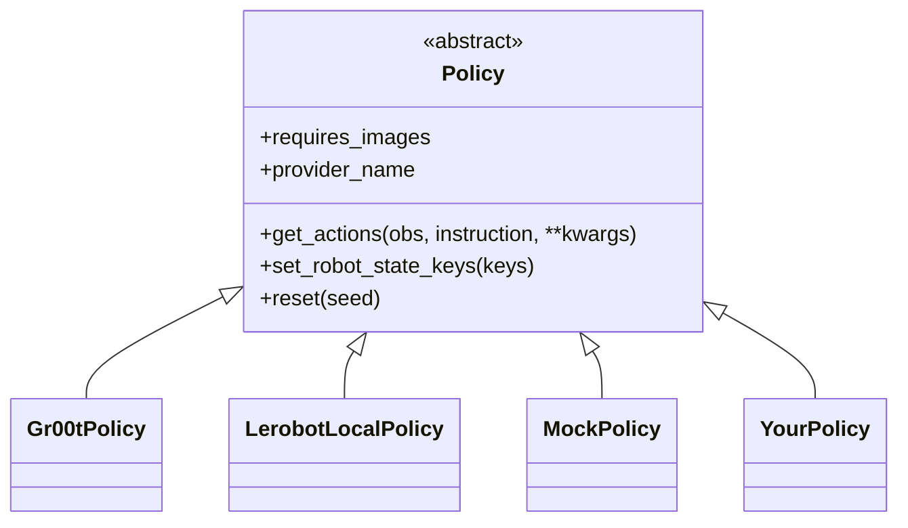

<div align="center">
  <div>
    <a href="https://strandsagents.com">
      
    </a>
  </div>

  <h1>
    Strands Robots
  </h1>

  <h2>
    Control, simulate, and train robots with natural language
  </h2>

  <div align="center">
    <a href="https://pypi.org/project/strands-robots/"></a>
    <a href="https://github.com/strands-labs/robots"></a>
    <a href="https://github.com/strands-labs/robots/blob/main/LICENSE"></a>
    <a href="https://github.com/google-deepmind/mujoco"></a>
    <a href="https://github.com/NVIDIA/Isaac-GR00T"></a>
    <a href="https://github.com/huggingface/lerobot"></a>
  </div>

  <p>
    <a href="https://strandsagents.com/">Strands Docs</a>
    ◆ <a href="https://github.com/google-deepmind/mujoco">MuJoCo</a>
    ◆ <a href="https://github.com/NVIDIA/Isaac-GR00T">NVIDIA GR00T</a>
    ◆ <a href="https://github.com/huggingface/lerobot">LeRobot</a>
    ◆ <a href="https://github.com/strands-labs/robots-sim">Robots Sim</a>
    ◆ <a href="https://github.com/orgs/strands-labs/projects/2">Project Board</a>
  </p>
</div>

<p align="center">
  
</p>

`strands-robots` gives a [Strands Agent](https://github.com/strands-agents/harness-sdk)
hands. One `Robot()` call returns either a **MuJoCo simulation** (default, no GPU,
no hardware) or a **real hardware robot** - both drivable in natural language,
both auto-joined to a peer-to-peer **mesh** so fleets coordinate out of the box.

```python
from strands import Agent
from strands_robots import Robot

robot = Robot("so100") # MuJoCo sim by default - no hardware needed
agent = Agent(tools=[robot])
agent("Pick up the red cube")
```

Swap to physical hardware with one kwarg - the agent code is identical:

```python
robot = Robot("so100", mode="real", port="/dev/ttyACM0")
```

## Why strands-robots

- **Sim-first, safe by default.** `Robot("so100")` spins up a MuJoCo world. You
  never accidentally drive real servos - `mode="real"` is an explicit opt-in.
- **50+ robots, 8 categories.** Arms, humanoids, quadrupeds, hands, drones,
  bimanual rigs - resolved from a single registry with auto-download of assets.
- **Any policy.** VLA models (NVIDIA GR00T, LeRobot ACT/Pi0/SmolVLA/Diffusion),
  plus classical motion planners, MPC, and scripted controllers behind one ABC.
- **Mesh networking built in.** Every robot is a Zenoh peer. `tell()` another
  robot what to do; broadcast an E-STOP; bridge to AWS IoT Core for fleets.
- **60+ action simulation tool.** World building, physics, rendering,
  domain randomization, and LeRobotDataset recording - all agent-callable.
- **One mental model.** Sim and hardware share the same policy interface,
  the same mesh, and the same natural-language control surface.

## How it works


## Installation

Examples use [`uv`](https://docs.astral.sh/uv/) (`curl -LsSf https://astral.sh/uv/install.sh | sh`); plain `pip` works too.

```bash
uv pip install strands-robots
```

The base install is light (numpy, opencv-headless, Pillow). Pull in only the
extras you need:

| Extra | Installs | Use for |
|-------|----------|---------|
| `sim-mujoco` | MuJoCo, robot_descriptions, imageio | Simulation (recommended starting point) |
| `lerobot` | LeRobot | Real hardware, local VLA inference, dataset recording |
| `molmoact2` | LeRobot + transformers, peft, scipy | MolmoAct2 transformers-native VLA (needs lerobot from source until PyPI >= 0.5.2) |
| `groot-service` | pyzmq, msgpack | NVIDIA GR00T inference client |
| `curobo` | _(empty; install cuRobo from source)_ | In-process collision-aware motion planning (CUDA GPU) |
| `wbc` | onnxruntime | GR00T Whole-Body-Control (SONIC) humanoid locomotion - in-process ONNX, no GPU |
| `mesh` | eclipse-zenoh, json5 | Peer-to-peer robot mesh |
| `mesh-iot` | awsiotsdk, awscrt, boto3 | AWS IoT Core mesh transport for fleets |
| `device-connect` | device-connect-edge, device-connect-agent-tools | Device-aware networking - discovery, RPC, events, safety (falls back to the built-in mesh if absent) |
| `benchmark-libero` | libero | LIBERO benchmark evaluation |
| `all` | everything above | Kitchen sink |

```bash
# Most users start here:
uv pip install "strands-robots[sim-mujoco]"

# Real hardware + local policies:
uv pip install "strands-robots[sim-mujoco,lerobot]"

# MolmoAct2 VLA (lerobot from source until a PyPI >= 0.5.2 ships PR #3604):
uv pip install "strands-robots[molmoact2]" \
    "lerobot[feetech] @ git+https://github.com/huggingface/lerobot.git"

# Everything:
uv pip install "strands-robots[all]"
```

From source:

```bash
git clone https://github.com/strands-labs/robots
cd robots
uv pip install -e ".[all,dev]"
```

## Quick starts

### Simulation (no GPU, no hardware)

```python
from strands import Agent
from strands_robots import Robot

robot = Robot("so100") # MuJoCo simulation
agent = Agent(tools=[robot])
agent("Wave the arm using the mock policy for 200 steps, then render a top-down view")
```

`Robot("so100")` returns a `Simulation` instance - the full 64-action
simulation AgentTool. Drive it in natural language through an `Agent`, call its
methods directly (`robot.render(camera_name="topdown")`), or dispatch an action
by calling it (`robot(action="render", camera_name="topdown")`). See
[Simulation](#simulation-mujoco).

> **Note:** `Robot("so100")` already creates the world **and** adds the robot
> for you. Do **not** call `create_world()` again on the returned instance -
> it will error with *"World already exists."* The `create_world()` /
> `add_robot()` sequence shown in [Simulation (MuJoCo)](#simulation-mujoco) is
> for the low-level `Simulation(...)` constructor, which starts empty.

### Real hardware + GR00T

```python
from strands import Agent
from strands_robots import Robot, gr00t_inference

robot = Robot(
    "so101",
    mode="real",
    cameras={
        "front": {"type": "opencv", "index_or_path": "/dev/video0", "fps": 30},
        "wrist": {"type": "opencv", "index_or_path": "/dev/video2", "fps": 30},
    },
    port="/dev/ttyACM0",
    data_config="so100_dualcam",
)

agent = Agent(tools=[robot, gr00t_inference])

# Start the GR00T inference service (Docker, Jetson/x86 GPU)
agent.tool.gr00t_inference(
    action="start",
    checkpoint_path="/data/checkpoints/model",
    port=8000,
    data_config="so100_dualcam",
)

agent("Use so101 to pick up the red block with the GR00T policy on port 8000")
```

### Local LeRobot policy (no inference server)

```python
from strands_robots import create_policy

# Direct HuggingFace inference - ACT, Pi0, SmolVLA, Diffusion, ...
policy = create_policy("lerobot/act_aloha_sim_transfer_cube_human")
```

## The `Robot()` factory

`Robot()` is a factory, not a wrapper - you get the real backend instance back
with all its methods.

```python
Robot("so100")                       # mode="sim"  (default, safe)
Robot("so100", mode="real")          # explicit hardware opt-in
Robot("so100", mode="auto")          # probe USB for servos, fall back to sim
Robot("my_arm", urdf_path="arm.xml") # bring your own MJCF/URDF
```

| Parameter | Type | Default | Description |
|-----------|------|---------|-------------|
| `name` | `str` | required | Robot name or alias (see [Supported robots](#supported-robots)) |
| `mode` | `str` | `"sim"` | `"sim"`, `"real"`, or `"auto"` (case-insensitive) |
| `backend` | `str` | `"mujoco"` | Sim backend (Isaac/Newton on the roadmap) |
| `urdf_path` | `str` | `None` | Explicit MJCF/URDF path (skips registry lookup) |
| `cameras` | `dict` | `None` | Camera config (**`mode="real"` only**) |
| `position` | `list[float]` | `[0,0,0]` | Spawn position in the sim world |
| `data_config` | `str` | name | Observation/action schema name |
| `mesh` | `bool` | `True` | Auto-join the Zenoh mesh |

Safety/validation rules:
- **Defaults to sim.** Real hardware is always an explicit `mode="real"`.
- **`cameras=` is rejected in sim mode** - add sim cameras via the `add_camera`
  action after creation.
- **Unknown robot names raise `ValueError`** unless you pass `urdf_path=`.
- **`STRANDS_ROBOT_MODE`** overrides detection; a typo'd value logs a warning
  and falls back to sim.

## Supported robots

50+ robots across 8 categories, resolved from
[`registry/robots.json`](strands_robots/registry/robots.json). Assets
(MJCF + meshes) auto-download from
[robot_descriptions](https://github.com/robot-descriptions/robot_descriptions.py)
/ [MuJoCo Menagerie](https://github.com/google-deepmind/mujoco_menagerie) on
first use. List them at runtime with `from strands_robots import list_robots; list_robots()`.

| Category | Count | Robots |
|----------|-------|--------|
| **Arm** | 22 | so100, so101, koch, omx, panda, fr3, fr3_v2, ur5e, ur10e, xarm7, kinova_gen3, kuka_iiwa, sawyer, piper, yam, z1, vx300s, wx250s, arx_l5, openarm, hope_jr, dynamixel_2r |
| **Humanoid** | 18 | unitree_g1, unitree_h1, unitree_h1_2, apollo, talos, reachy2, rby1, fourier_n1, booster_t1, adam_lite, asimov_v0, cassie, elf2, jvrc, op3, open_duck_mini, toddlerbot_2xc, toddlerbot_2xm |
| **Mobile** | 13 | spot, go1, unitree_go2, unitree_a1, aliengo, anymal_b, anymal_c, stretch, stretch3, lekiwi, tiago_dual, earthrover, robot_soccer_kit |
| **Hand** | 8 | shadow_hand, shadow_dexee, allegro_hand, leap_hand, ability_hand, aero_hand, robotiq_2f85, robotiq_2f85_v4 |
| **Bimanual** | 3 | aloha, bi_openarm, trossen_wxai |
| **Aerial** | 2 | crazyflie, skydio_x2 |
| **Expressive** | 1 | reachy_mini |
| **Mobile manip** | 1 | google_robot |

**Hardware-capable** (drivable with `mode="real"` via LeRobot): `so100`,
`so101`, `koch`, `omx`, `hope_jr`, `aloha`, `bi_openarm`, `reachy2`,
`unitree_g1`, `lekiwi`, `earthrover`. All are simulatable.

## Tools reference

Import any of these and pass to `Agent(tools=[...])`. Each is a Strands
AgentTool returning `{"status", "content"}`.

| Tool | Purpose |
|------|---------|
| `Robot(...)` | Universal robot - sim or hardware, async control |
| `gr00t_inference` | Manage NVIDIA GR00T inference services (Docker lifecycle) |
| `lerobot_camera` | OpenCV / RealSense camera discovery, capture, record |
| `lerobot_calibrate` | List, view, back up, restore LeRobot calibrations |
| `lerobot_teleoperate` | Record demonstrations, replay episodes |
| `pose_tool` | Store, recall, and execute named robot poses |
| `serial_tool` | Low-level Feetech servo / raw serial communication |
| `robot_mesh` | Coordinate robots over the Zenoh mesh (`tell`, `broadcast`, E-STOP) |

<details>
<summary><b>Robot tool actions</b></summary>

| Action | Parameters | Description |
|--------|------------|-------------|
| `execute` | `instruction`, `policy_port`, `duration` | Blocking execution until complete |
| `start` | `instruction`, `policy_port`, `duration` | Non-blocking async start |
| `status` | - | Current task status |
| `stop` | - | Interrupt running task (emergency stop) |
In sim mode the same tool exposes the 64 Simulation actions - see Simulation (MuJoCo).
</details>

<details>
<summary><b>GR00T inference tool actions</b></summary>

| Action | Parameters | Description |
|--------|------------|-------------|
| `start` | `checkpoint_path`, `port`, `data_config` | Start inference service |
| `stop` | `port` | Stop service on port |
| `status` | `port` | Check service status |
| `list` | - | List running services |
| `find_containers` | - | Find GR00T Docker containers |
| `build_image` / `download_checkpoint` / `start_container` | - | Full container lifecycle orchestration |

**TensorRT** acceleration:

```python
agent.tool.gr00t_inference(
    action="start",
    checkpoint_path="/data/checkpoints/model",
    port=8000,
    use_tensorrt=True,
    vit_dtype="fp8",     # ViT:  fp16 | fp8
    llm_dtype="nvfp4",   # LLM:  fp16 | nvfp4 | fp8
    dit_dtype="fp8",     # DiT:  fp16 | fp8
)
```

</details>

<details>
<summary><b>Camera / serial / pose / teleop tool actions</b></summary>

**Camera** - `discover`, `capture`, `capture_batch`, `record`, `preview`, `test`
**Serial** - `list_ports`, `feetech_position`, `feetech_ping`, `send`, `monitor`
**Pose** - `store_pose`, `load_pose`, `list_poses`, `move_motor`, `incremental_move`, `reset_to_home`
**Teleop** - `start`, `stop`, `list`, `replay`

</details>

## Policy providers

All policies implement one ABC - `async get_actions(observation, instruction, **kwargs)`.
The interface is deliberately agnostic about *how* actions are produced, so it
fits both VLA models and classical controllers.

```python
from strands_robots import create_policy

create_policy("mock")                                  # sinusoidal test actions
create_policy("groot", port=5555)                      # NVIDIA GR00T via ZMQ
create_policy("zmq://localhost:5555")                  # same, by URL
create_policy("lerobot/act_aloha_sim_transfer_cube")   # local HF inference
```

| Provider | Backend | Notes |
|----------|---------|-------|
| `mock` | none | Sinusoidal trajectories; `requires_images=False` (~10x faster) |
| `groot` | NVIDIA GR00T N1.5/N1.6/N1.7 | Service mode (ZMQ to a Docker container) or local in-process (`model_path=`) |
| `lerobot_local` | HuggingFace | Direct ACT / Pi0 / SmolVLA / Diffusion inference, no server |



<details>
<summary><b>GR00T data configs (embodiment schemas)</b></summary>

A `data_config` defines the video + state keys GR00T expects for an
embodiment. 27 ship in
[`policies/groot/data_configs.json`](strands_robots/policies/groot/data_configs.json);
the common ones:

| Config | Cameras | Description |
|--------|---------|-------------|
| `so100` / `so101` | 1 (`video.webcam`) | Single-arm, single camera |
| `so100_dualcam` / `so101_dualcam` | 2 (front + wrist) | Single-arm, dual camera |
| `so100_4cam` | 4 (front, wrist, top, side) | Single-arm, quad camera |
| `so101_tricam` | 3 (front, wrist, side) | Single-arm, tri camera |
| `fourier_gr1_arms_only` | 1 (ego) | Fourier GR-1 bimanual arms + hands |
| `unitree_g1` | 1 (ego) | G1 upper body (arms + hands) |
| `unitree_g1_full_body` / `_locomanip` | - | G1 legs + waist + arms + hands |
| `bimanual_panda_gripper` | 3 | Dual Franka, EEF pose + gripper |
| `libero_panda` | 2 (image + wrist) | LIBERO benchmark Panda |
| `oxe_droid` / `oxe_google` / `oxe_widowx` | 1-2 | Open X-Embodiment schemas |
| `agibot_*` / `galaxea_r1_pro` | 3 | AgiBot / Galaxea humanoids |

Pick the config matching your robot's camera + state layout; pass it as
`data_config=` to `Robot(...)`, `gr00t_inference(...)`, or `create_policy("groot", ...)`.

</details>

> **Security:** `lerobot_local` loads HuggingFace models with
> `trust_remote_code=True` (arbitrary code execution). You must opt in with
> `export STRANDS_TRUST_REMOTE_CODE=1`. Only load models you trust.

### Cosmos 3 (NVIDIA omnimodal VLA - service mode)

[`nvidia/Cosmos3-Nano-Policy-DROID`](https://huggingface.co/nvidia/Cosmos3-Nano-Policy-DROID)
served by the Cosmos Framework RoboLab WebSocket policy server. The policy
client is **self-contained** - it speaks the server's msgpack+NumPy wire
protocol directly via `websockets` + a vendored numpy packer (no
`openpi-client` dependency, no `numpy<2` pin), so it composes cleanly with
`lerobot` for dataset recording in the same env.

**1. Start the server** (holds the GPU), from a Cosmos Framework checkout:

```bash
uv sync --all-extras --group=cu130-train --group=policy-server
python -m cosmos_framework.scripts.action_policy_server_robolab \
    --checkpoint-path nvidia/Cosmos3-Nano-Policy-DROID --port 8000
curl http://localhost:8000/healthz   # -> 200 when ready (~4 min cold)
```

**2. Install the client** (the `cosmos3-service` extra ships only `msgpack`
+ `websockets` - numpy-version agnostic):

```bash
uv pip install -e '.[sim-mujoco]'
uv pip install 'strands-robots[cosmos3-service]'
```

**3. Use it** (`cosmos3`, `c3`, `cosmos3://host:port`, or the HF model-id all
resolve to `Cosmos3Policy`):

```python
from strands_robots.policies import create_policy

policy = create_policy("cosmos3", embodiment="droid", port=8000)
policy.set_robot_state_keys([f"joint_{i}" for i in range(7)] + ["gripper"])
chunk = policy.get_actions_sync(observation, "pick up the cube")
# chunk == [{"joint_0": .., ..., "gripper": ..}, ...]  (one dict per timestep)
```

**4. Roll out in MuJoCo** - the `droid` embodiment drives a Franka/DROID-class
arm, so use the `franka` (or `panda`) sim asset:

```bash
MUJOCO_GL=egl python examples/cosmos3_sim_rollout.py --record /tmp/c3.mp4
```

Embodiments: `droid` (10D, chunk 32, 15 fps), `umi`, `av`, `bridge`. If the
server is not running, the policy raises a `ConnectionError` with the exact
command to start it.

### Non-VLA policies (motion planners, MPC, scripted)

The same interface fits cuRobo, MoveIt2, OMPL, MPC, and pure-IK / scripted
trajectories - anything mapping `(observation, goal)` to joint targets.
Non-VLA providers set `requires_images = False` (skip camera rendering) and
read their goal from **well-known `**kwargs` keys** instead of parsing the
instruction string:

| Key | Type | Meaning |
|-----|------|---------|
| `target_pose` | `list[float]` | Cartesian goal `[x, y, z, qw, qx, qy, qz]` in base frame |
| `target_joints` | `dict[str, float]` | Joint-space goal keyed by joint name (rad / m) |
| `world_update` | `dict \| None` | Per-call world refresh for collision-aware planners |

Providers MUST ignore unknown `**kwargs` rather than raising, so callers can
pass shared keys across providers without coupling to a backend.

```python
from typing import Any
from strands_robots.policies import Policy, register_policy, create_policy


class ReachPolicy(Policy):
    """Linear interpolation from current joint state to target_joints."""

    def __init__(self, steps: int = 32, **_: Any) -> None:
        self._keys: list[str] = []
        self._steps = steps

    @property
    def provider_name(self) -> str:
        return "reach"

    @property
    def requires_images(self) -> bool:
        return False  # joint-state only -- skip camera rendering

    def set_robot_state_keys(self, robot_state_keys: list[str]) -> None:
        self._keys = list(robot_state_keys)

    async def get_actions(self, observation_dict, instruction, **kwargs):
        target = kwargs.get("target_joints")
        if target is None:
            raise ValueError("ReachPolicy requires target_joints kwarg")
        state = observation_dict.get("observation.state", [0.0] * len(self._keys))
        out = []
        for s in range(1, self._steps + 1):
            alpha = s / self._steps
            out.append({k: (1 - alpha) * state[i] + alpha * target[k]
                        for i, k in enumerate(self._keys)})
        return out


register_policy("reach", lambda: ReachPolicy, aliases=["lerp"])
policy = create_policy("reach")
```

#### `MoveIt2Policy` (reference implementation, ROS 2 sidecar)

`MoveIt2Policy` is a thin ZMQ + msgpack client that talks to a sidecar
ROS 2 node running `moveit_py`. The ROS 2 stack lives entirely
out-of-process, so users without ROS 2 sourced are unaffected — the only
client-side dependency is the `[moveit2]` extra (`pyzmq`, `msgpack`).

```bash
pip install 'strands-robots[moveit2]'
```

Bring up the sidecar via the docker-compose recipe at
[`strands_robots/policies/moveit2/server/`](./strands_robots/policies/moveit2/server/)
or natively with `python -m strands_robots.policies.moveit2.server.zmq_node`,
then:

```python
from strands_robots.policies import create_policy

policy = create_policy(
    "moveit2",                    # alias: "moveit"
    host="127.0.0.1",
    port=5556,
    planning_group="arm",
)

actions = policy.get_actions_sync(
    observation_dict={"observation.state": [0.0] * 6},
    instruction="reach for the red block",   # ignored by planners
    target_pose=[0.3, 0.0, 0.4, 1.0, 0.0, 0.0, 0.0],
)
```

See the [MoveIt2 policy docs](https://strands-labs.github.io/robots/policies/moveit2/)
for the goal-kwarg vocabulary, trajectory chunking, and sidecar deployment.

#### `CuroboPolicy` (in-process collision-aware planning, GPU)

[`CuroboPolicy`](./strands_robots/policies/curobo/policy.py) wraps NVIDIA's
[cuRobo](https://curobo.org/) `MotionPlanner`. Unlike sidecar-style
providers, cuRobo runs **in the same process** as a CUDA library - there is
no network round-trip, but a CUDA-capable GPU is required.

> **Install note**: cuRobo is **not** published on PyPI (the
> `nvidia-curobo` package on PyPI is an unrelated v0.1 squatter). Install
> from source from the upstream repository, then install this package:
>
> ```bash
> git clone https://github.com/NVlabs/curobo.git
> pip install -e ./curobo
> pip install 'strands-robots[curobo]'   # extra is currently empty;
>                                        # reserved for when cuRobo
>                                        # publishes a real PyPI wheel
> ```
>
> This policy targets cuRobo's restructured `main` API (issue #421):
> `MotionPlanner` / `MotionPlannerCfg` / `DeviceCfg` / `JointState` /
> `GoalToolPose`. The on-device cuRobo APIs are still moving on `main`
> until upstream cuts a stable release; if you hit a fresh API shift
> pin to a known-good commit (or open an issue against this repo with
> the cuRobo SHA you tested).

```python
from strands_robots.policies import create_policy

policy = create_policy(
    "curobo",                      # alias: "cumotion"
    robot_config="franka.yml",     # any cuRobo built-in YAML, or a dict
    action_horizon=16,
)

actions = policy.get_actions_sync(
    observation_dict={"observation.state": [0.0, -0.7854, 0.0, -2.3562, 0.0, 1.5708, 0.7854]},
    instruction="reach for the red block",   # ignored by planners
    target_pose=[0.5, 0.0, 0.4, 1.0, 0.0, 0.0, 0.0],
)
```

The full collision-free trajectory is cached on the first call; each
subsequent call yields up to `action_horizon` waypoints from the cache so
the 50Hz execution loop in `Robot` can stream per-step joint targets without
re-planning. Pass `replan=True` (or call `policy.reset()`) to force a fresh
plan when the world has updated mid-rollout. `world_update` is forwarded to
`MotionPlanner.update_scene` (or the legacy `update_world` shim) for
per-call collision-scene refresh.

The LLM-agent demo path (`Robot.start_task(..., policy_provider="curobo",
target_pose=[...])`) flows the same `target_pose` / `target_joints` kwargs
through `start_task`'s `**policy_kwargs` so agents share one goal vocabulary
across VLA and planner providers.

#### `WBCPolicy` (GR00T Whole-Body-Control / SONIC, in-process ONNX)

[`WBCPolicy`](./strands_robots/policies/wbc/policy.py) wraps NVIDIA's
[GR00T-WholeBodyControl](https://github.com/NVlabs/GR00T-WholeBodyControl)
(SONIC) ONNX controllers for deploy-grade humanoid locomotion on the Unitree
G1. Like cuRobo it runs **in-process** (ONNX Runtime), but needs no GPU - the
sessions run on CPU. It is non-VLA (`requires_images = False`) and reads its
goal from the locomotion kwarg `target_velocity = [vx, vy, omega]`. It drives
the **15 leg+waist DOFs**; arm joints are held at their defaults (layering an
upper-body policy is a future `CompositePolicy`).

```bash
pip install "strands-robots[wbc]"   # onnxruntime only - light, no torch/GPU
```

No weights are bundled; download a SONIC checkpoint under the NVIDIA Open Model
License (e.g. `nvidia/GEAR-SONIC`) into a dir with `policy.onnx`.

```python
from strands_robots import Robot

sim = Robot("unitree_g1")             # sim-by-default; CPU ONNX, no GPU
sim.run_policy(
    robot_name="unitree_g1",
    policy_provider="wbc",            # shorthand: "sonic"
    policy_config={"checkpoint": "/path/to/GEAR-SONIC", "walk": True},
    policy_kwargs={"target_velocity": [0.5, 0.0, 0.0]},
    duration=10.0,
    control_frequency=50.0,
    action_horizon=1,                 # WBC is closed-loop per tick
)
```

The per-call locomotion command rides through `run_policy`'s `policy_kwargs`
to `policy.get_actions(..., target_velocity=[...])`. WBC output index `i`
drives an explicit `unitree_g1` leg+waist actuator (no positional guessing);
a model whose joint order disagrees raises rather than actuating wrong joints.
See the [WBC policy docs](https://strands-labs.github.io/robots/policies/wbc/).

## Simulation (MuJoCo)

`Robot("so100")` (sim mode) returns a `Simulation` - a MuJoCo-backed AgentTool
exposing **50+ actions** for world composition, physics, rendering, policy
execution, and dataset recording. Build it directly when you want full control:

```python
from strands_robots.simulation import Simulation

sim = Simulation(tool_name="sim", mesh=False)
sim.create_world()
sim.add_robot(name="arm", data_config="so100")
sim.add_object(name="cube", shape="box", position=[0.3, 0, 0.05])
sim.add_camera(name="topdown", position=[0, 0, 1.5], target=[0, 0, 0])

# Wrist camera: mount ON the gripper body so it tracks the arm like the real
# SO101/SO100 hardware cam. position/target are in the body's LOCAL frame.
# Body names are namespaced "<robot>/<body>" (e.g. "arm/gripper").
sim.add_camera(name="wrist", position=[0, -0.05, 0], target=[0, -0.15, 0],
               parent_body="arm/gripper")

sim.run_policy(robot_name="arm", policy_provider="mock", n_steps=200,
               control_frequency=50.0)

frame = sim.render(camera_name="topdown")   # {status, content:[text, image]}
```

<details>
<summary><b>The actions, grouped</b></summary>

- **World & scene**: `create_world`, `load_scene`, `replace_scene_mjcf`,
  `patch_scene_mjcf`, `reset`, `get_state`, `save_state`, `load_state`,
  `destroy`, `export_xml`.
- **Robots**: `add_robot`, `remove_robot`, `list_robots`, `get_robot_state`,
  `list_urdfs`, `register_urdf`, `get_features`.
- **Objects**: `add_object`, `remove_object`, `move_object`, `list_objects`.
- **Cameras & rendering**: `add_camera`, `remove_camera`, `render`,
  `render_depth`, `render_all`, `start_cameras_recording`,
  `stop_cameras_recording`, `get_cameras_recording_status`.
- **Physics**: `step`, `set_timestep`, `set_gravity`, `apply_force`, `raycast`,
  `multi_raycast`, `get_contacts`, `get_contact_forces`, `get_body_state`,
  `set_joint_positions`, `set_joint_velocities`, `forward_kinematics`,
  `get_jacobian`, `get_mass_matrix`, `inverse_dynamics`, `get_total_mass`,
  `get_energy`, `get_sensor_data`, `set_body_properties`, `set_geom_properties`.
- **Policy**: `run_policy`, `start_policy`, `stop_policy`,
  `list_policies_running`, `replay_episode`, `eval_policy`.
- **Randomization**: `randomize`.
- **Recording (LeRobotDataset)**: `start_recording`, `stop_recording`,
  `get_recording_status`.
- **Benchmarks**: `list_benchmarks`, `register_benchmark_from_file`,
  `evaluate_benchmark`.
- **Viewer**: `open_viewer`, `close_viewer`.

</details>

<details>
<summary><b>Common footguns</b></summary>

- **Planes must be static.** `add_object(shape="plane")` auto-sets
  `is_static=True`; passing `is_static=False` is a hard error.
- **Aim cameras.** Pass `target=[x,y,z]` to look at a point; `target == position`
  errors.
- **Wrist cameras mount on a body.** Pass `parent_body="<robot>/gripper"` to
  `add_camera` so the camera rides with the arm (realistic SO101/SO100 wrist
  cam). In that mode `position`/`target` are in the body's LOCAL frame, not
  world coordinates. Omit `parent_body` for a world-fixed camera.
- **MP4 vs dataset recording.** `start_cameras_recording` writes plain MP4
  (`[sim-mujoco]` only). `start_recording` writes a LeRobotDataset (parquet +
  MP4 + schema) and needs the `[lerobot]` extra.
- **Policy running → mutations blocked.** While a policy runs, state-mutating
  actions error with *"Cannot 'X' while a policy is running."* Stop it first.
- **Horizon parameters.** `run_policy` takes either `duration` or `n_steps`
  (both with `control_frequency`). `fast_mode=True` skips the between-step
  sleep for batch eval / data collection.
- **Name collisions.** Objects, bodies, robots, and cameras share the MuJoCo
  name table. Multi-robot joints/actuators are namespaced `{robot}/{joint}`.

</details>

**Self-healing:** unknown parameters are rejected with *"Unknown parameter X
for action Y. Valid: [...]"*, missing required params produce *"Action X
requires parameter Y."*, and vectors/dtypes are validated before MuJoCo sees
them - so the agent learns the contract without crashing the process.

## Mesh networking

Every `Robot()` and `Simulation()` is automatically a peer on a local Zenoh
mesh - no setup. Peers on the same LAN discover each other via multicast
scouting, sharing a single ref-counted `zenoh.Session` per process.

```python
from strands_robots import Robot

a = Robot("so100")              # auto-joins the mesh
b = Robot("so100")              # second peer (another process)
print(a.mesh.peers)             # list[dict] - discovers b
print(a.mesh.peers_by_id[b.peer_id])   # dict[peer_id -> info] for O(1) lookup
info = a.mesh.get_peer(b.peer_id)      # None-safe single lookup

a.mesh.tell(b.peer_id, "pick up the cube")
a.mesh.emergency_stop()         # broadcast E-STOP, audited to disk
```

`tell()` routes to hardware **and** sim peers. Per-call policy kwargs
(`target_pose`, `target_joints`, `world_update`) and constructor extras are
forwarded end-to-end via `policy_config`, so a planner-style policy on a sim
peer sees the goal payload it needs:

```python
a.mesh.tell(
    b.peer_id,
    "reach for the red block",
    policy_provider="curobo",
    target_pose=[0.3, 0.0, 0.4, 1.0, 0.0, 0.0, 0.0],
    robot_name="arm_left",      # disambiguate in multi-robot sims
    duration=10.0,
)
```

Expose the mesh to an agent with the `robot_mesh` tool (`peers`, `status`,
`tell`, `send`, `broadcast`, `stop`, `emergency_stop`, `subscribe`, `watch`,
`inbox`). Disable globally with `STRANDS_MESH=false` or per-robot with
`Robot("so100", mesh=False)`. Install with `uv pip install "strands-robots[mesh]"`.

For frictionless single-machine experiments, set `STRANDS_MESH_LOCAL_DEV=1` -
one env var that runs the mesh without mTLS/ACL on localhost. It defaults the
auth mode to `none` **and** satisfies the insecure-acknowledgement second
factor by itself, so you don't also need `STRANDS_MESH_I_KNOW_THIS_IS_INSECURE=1`.
An explicit `STRANDS_MESH_AUTH_MODE=mtls` still wins. **Never** set
`STRANDS_MESH_LOCAL_DEV` on a shared or production network.

### AWS IoT Core transport (fleets)

For robots across networks, bridge the mesh to AWS IoT Core over MQTT5/mTLS,
with Device Shadow mirroring, S3 camera offload, and account-wide Fleet
Provisioning. Hardened with CA pinning, strict thing-name validation,
deny-by-default IoT policy scoping, and a safety audit log.
Install with `uv pip install "strands-robots[mesh-iot]"`. See the
[Configuration](#configuration) matrix for the `STRANDS_MESH_*` knobs.

## Configuration

### Environment variables

| Variable | Description | Default |
|----------|-------------|---------|
| `STRANDS_ROBOT_MODE` | `Robot()` factory mode: `sim` / `real` / `auto` | `sim` |
| `STRANDS_ASSETS_DIR` | Robot model asset cache directory | `~/.strands_robots/assets/` |
| `STRANDS_TRUST_REMOTE_CODE` | Set `1` to allow HF `trust_remote_code` for `lerobot_local` | unset |
| `MUJOCO_GL` | MuJoCo GL backend (`egl`, `osmesa`, `glfw`) | auto |
| `GROOT_API_TOKEN` | API token for the GR00T inference service | unset |
| `STRANDS_MESH` | Set `false` to disable Zenoh mesh globally | `true` |
| `STRANDS_MESH_LOCAL_DEV` | Set `1` for a one-var localhost preset (auth `none`, no second factor needed) | unset |
| `STRANDS_MESH_AUTH_MODE` | Wire auth: `mtls` or `none` (`none` needs a second factor) | `mtls` |
| `STRANDS_MESH_I_KNOW_THIS_IS_INSECURE` | Second factor required to bring up `AUTH_MODE=none` | unset |
| `STRANDS_MESH_PORT` | TCP port for the local Zenoh router | `7447` |
| `ZENOH_CONNECT` | Comma-separated remote Zenoh endpoints to connect to | unset |
| `ZENOH_LISTEN` | Comma-separated endpoints for the local Zenoh listener | unset |
| `STRANDS_MESH_AUDIT_DIR` | Directory for the safety audit log (`mesh_audit.jsonl`) | `~/.strands_robots/` |
| `STRANDS_MESH_CA_PINS` | Additional SHA-256 CA pins (comma-separated 64-char hex) | unset |
| `STRANDS_MESH_DISABLE_CA_PIN` | Skip CA pin check on download path (break-glass) | `false` |
| `STRANDS_MESH_CAMERA_PRESIGN_TTL` | TTL (s) for S3 presigned camera URLs; capped at 3600 | `60` |
| `STRANDS_MESH_ACL_FILE` | Path to a JSON5 Zenoh ACL file; unset = permissive default. See `examples/mesh_acl_example.json5` (role-scoped) and `examples/mesh_acl_strict_per_peer.json5` (per-peer). **⚠️ Required on any WAN/cloud router: mTLS gives identity, not least-privilege — without a topic-level ACL one device cert can read all fleet traffic and command any robot. See [security docs](docs/security.md#production-posture-required-off-trusted-networks).** | unset |
| `STRANDS_MESH_POLICY_HOST_ALLOW` | Comma-separated allowlist of VLA policy-server hosts/CIDRs for inference | loopback only |
| `STRANDS_MESH_HITL_ACTIONS` | `robot_mesh` actions needing a human-in-the-loop interrupt: `all` / `none` / subset of `emergency_stop,broadcast,tell,send,stop,subscribe,watch` | actuation default |
| `STRANDS_MESH_SUBSCRIBE_ALLOW` | Extra Zenoh key-expr patterns the `robot_mesh` `subscribe` action may target, beyond the built-in low-impact set | shared classes only |
| `STRANDS_MESH_OVERRIDE_CODE` | Shared secret for e-stop resume HMAC proof; unset means no remote resume possible | unset |
| `STRANDS_MESH_INPUT_VALUE_ABS` | Absolute value clamp for teleop joint commands (radians) | `12.566` (4pi) |
| `STRANDS_MESH_INPUT_MAX_HZ` | Per-receiver teleop apply-rate ceiling (0 = unlimited) | `100` |
| `STRANDS_MESH_MAX_PEERS` | Peer registry cap; evicts oldest on overflow | `1024` |
| `STRANDS_MESH_RESUME_MAX_FAILS` | Failed resume attempts before cooldown engages | `5` |
| `STRANDS_MESH_RESUME_BACKOFF_S` | Cooldown (seconds) after exceeding resume fail threshold | `30` |
| `STRANDS_MESH_INPUT_AUDIT_EVERY` | Emit `input_stream_applied` audit event every N frames (0 = off) | `100` |
| `STRANDS_ESTOP_DEDUP_TTL_S` | E-stop fan-out Lambda dedup window (seconds) | `30` |
| `STRANDS_MESH_BRIDGE_TOPICS` | Comma-separated topic suffixes the Zenoh<->IoT bridge forwards (exact match). Unset = the safe default set (`presence,health,safety/event,safety/estop,safety/resume,cmd,response,broadcast`). High-volume topics (`state,pose,imu,odom,lidar`) and LAN-only topics (`camera,input,hand`) are deliberately NOT bridged | default set |
| `STRANDS_MESH_BRIDGE_TOPICS_PREFIX` | Comma-separated topic suffixes the bridge matches as a path **prefix** (so `response` matches `response/<turn-id>`). Extend this (not `STRANDS_MESH_BRIDGE_TOPICS`) when adding an RPC-shape topic with a per-turn tail | `response` |
| `STRANDS_GR00T_IMAGE` | Container image the `gr00t_inference` tool runs (must pass the image allowlist; agent cannot choose it) | `gr00t:latest` |
| `STRANDS_GR00T_IMAGE_ALLOW` | Extra image-name patterns (trailing `*` = tag wildcard) added to the built-in allowlist (`gr00t:*`, `nvcr.io/nvidia/isaac-gr00t:*`) | built-in only |

<details>
<summary><b>Benchmark / diagnostic env vars (LIBERO, GR00T bisection)</b></summary>

| Variable | Description | Default |
|----------|-------------|---------|
| `STRANDS_LIBERO_ACTION_LOG` / `_MAX` | Per-step OSC controller diagnostics | unset / `50` |
| `STRANDS_LIBERO_STATE_LOG` / `_MAX` | Per-step state values fed to GR00T | unset / `50` |
| `STRANDS_GROOT_WIRE_LOG` / `_MAX_CALLS` | Dump pre/post inference payloads to verify LOCAL vs SERVICE parity | unset / `10` |

</details>

### Asset cache

```
~/.strands_robots/
└── assets/           # auto-downloaded MJCF + meshes
    ├── trs_so_arm100/
    ├── franka_emika_panda/
    └── ...
```

Clear with `rm -rf ~/.strands_robots/assets/`; relocate with
`export STRANDS_ASSETS_DIR=/path/to/dir`.

## Benchmarks

`strands-robots` ships a [LIBERO](https://github.com/Lifelong-Robot-Learning/LIBERO)
benchmark integration on the MuJoCo backend - byte-equivalent to upstream
LIBERO at the model level, reaching `success_rate >= 0.92` on libero-10/SCENE5.
Register declarative benchmarks from file and evaluate policies via the
`list_benchmarks`, `register_benchmark_from_file`, and `evaluate_benchmark`
simulation actions. Install with `uv pip install "strands-robots[benchmark-libero]"`.

## Project structure

```
strands_robots/
├── __init__.py            # Lazy-loaded public API (Robot, Simulation, policies)
├── robot.py               # Robot() factory (sim/real/auto dispatch)
├── hardware_robot.py      # HardwareRobot - async LeRobot control
├── policies/
│   ├── base.py            # Policy ABC
│   ├── factory.py         # create_policy() + runtime registration
│   ├── mock.py            # MockPolicy (non-VLA reference)
│   ├── groot/             # NVIDIA GR00T (ZMQ/HTTP client + data configs)
│   └── lerobot_local/     # Direct HuggingFace inference (RTC, processors)
├── registry/              # robots.json (50+) + policies.json + loaders
├── simulation/
│   ├── base.py            # SimEngine ABC
│   ├── factory.py         # create_simulation() + backend registry
│   ├── models.py          # SimWorld / SimRobot / SimObject / SimCamera
│   └── mujoco/            # MuJoCo backend (64-action AgentTool)
├── mesh/                  # Zenoh mesh: core, sensors, input, audit, transport, iot
├── benchmarks/libero/     # LIBERO suite + BDDL parser + adapter
└── tools/                 # gr00t_inference, lerobot_*, pose, serial, robot_mesh
```

## Development

```bash
uv pip install -e ".[all,dev]"

hatch run test          # unit tests
hatch run test-integ    # integration tests (GPU + model weights)
hatch run lint          # ruff check + format --check + mypy
hatch run format        # ruff check --fix + ruff format
```

Python 3.12+ required. See [AGENTS.md](AGENTS.md) for conventions and the
accumulated code-review learnings.

## Security

Found a vulnerability? **Do not** open a public issue. Follow the disclosure
process in [SECURITY.md](SECURITY.md) (AWS VDP / HackerOne).

Note the `trust_remote_code` gate on `lerobot_local` (see
[Policy providers](#policy-providers)) and the mesh CA-pinning / thing-name
validation controls in the [Configuration](#configuration) matrix.

## Contributing

Issues and PRs welcome. Track work on the
[Strands Labs - Robots project board](https://github.com/orgs/strands-labs/projects/2);
it is the source of truth for roadmap and follow-ups.

- [GitHub Issues](https://github.com/strands-labs/robots/issues)
- [Pull Requests](https://github.com/strands-labs/robots/pulls)

## License

Apache-2.0 - see [LICENSE](LICENSE).

## Links

<div align="center">
  <a href="https://github.com/strands-labs/robots">GitHub</a>
  ◆ <a href="https://pypi.org/project/strands-robots/">PyPI</a>
  ◆ <a href="https://github.com/google-deepmind/mujoco">MuJoCo</a>
  ◆ <a href="https://github.com/NVIDIA/Isaac-GR00T">NVIDIA GR00T</a>
  ◆ <a href="https://github.com/huggingface/lerobot">LeRobot</a>
  ◆ <a href="https://strandsagents.com/">Strands Docs</a>
</div>
