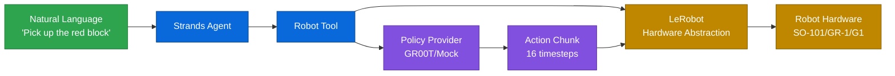
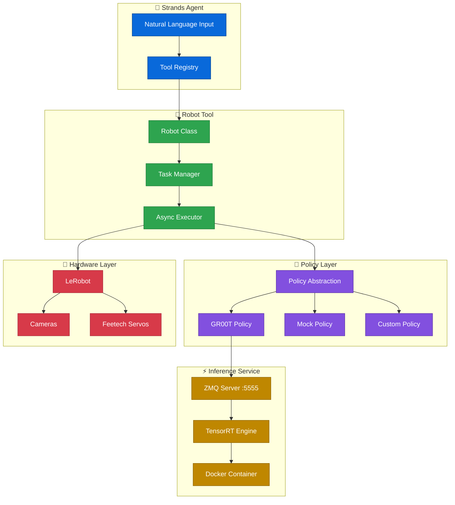
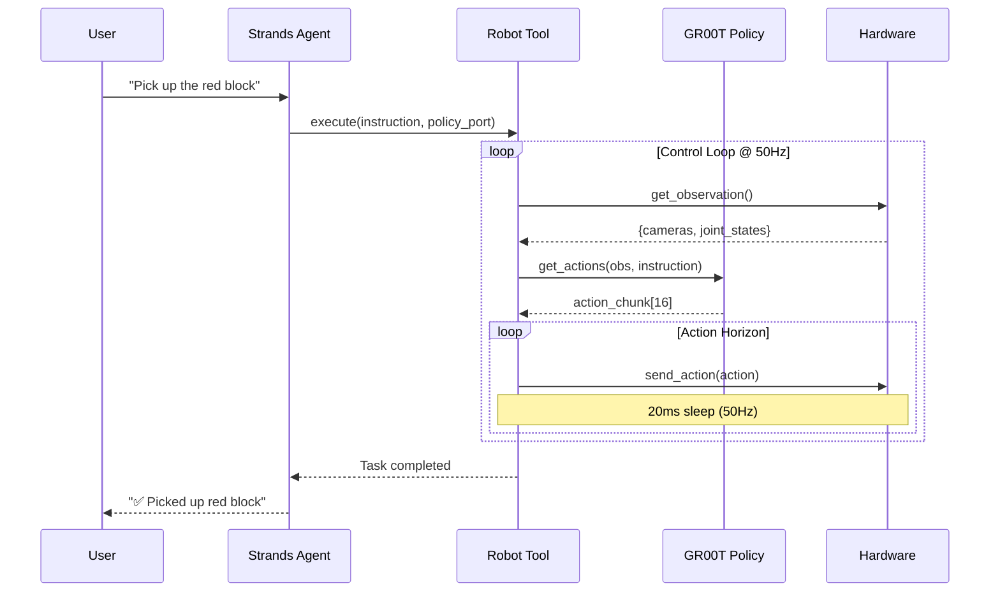
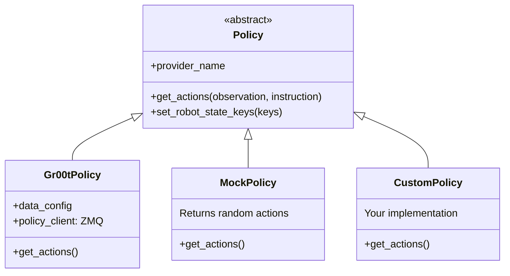

<div align="center">
  <div>
    <a href="https://strandsagents.com">
      
    </a>
  </div>

  <h1>
    Strands Robots
  </h1>

  <h2>
    Robot Control for Strands Agents
  </h2>

  <div align="center">
    <a href="https://pypi.org/project/strands-robots/"></a>
    <a href="https://github.com/strands-labs/robots"></a>
    <a href="https://github.com/strands-labs/robots/blob/main/LICENSE"></a>
    <a href="https://github.com/NVIDIA/Isaac-GR00T"></a>
    <a href="https://github.com/huggingface/lerobot"></a>
  </div>
  
  <p>
    <a href="https://strandsagents.com/">Strands Docs</a>
    ◆ <a href="https://github.com/NVIDIA/Isaac-GR00T">NVIDIA GR00T</a>
    ◆ <a href="https://github.com/huggingface/lerobot">LeRobot</a>
    ◆ <a href="https://github.com/dusty-nv/jetson-containers">Jetson Containers</a>
  </p>
</div>

Control robots with natural language through [Strands Agents](https://github.com/strands-agents/sdk-python). Integrates [NVIDIA Isaac GR00T](https://github.com/NVIDIA/Isaac-GR00T) for vision-language-action policies and [LeRobot](https://github.com/huggingface/lerobot) for universal robot support.

## How It Works



## Architecture



## Quick Start

```python
from strands import Agent
from strands_robots import Robot, gr00t_inference

# Create robot with cameras
robot = Robot(
    tool_name="my_arm",
    robot="so101_follower",
    cameras={
        "front": {"type": "opencv", "index_or_path": "/dev/video0", "fps": 30},
        "wrist": {"type": "opencv", "index_or_path": "/dev/video2", "fps": 30}
    },
    port="/dev/ttyACM0",
    data_config="so100_dualcam"
)

# Create agent with robot tool
agent = Agent(tools=[robot, gr00t_inference])

# Start GR00T inference service
agent.tool.gr00t_inference(
    action="start",
    checkpoint_path="/data/checkpoints/model",
    port=8000,
    data_config="so100_dualcam"
)

# Control robot with natural language
agent("Use my_arm to pick up the red block using GR00T policy on port 8000")
```

## Installation

```bash
pip install strands-robots
```

From source:

```bash
git clone https://github.com/strands-labs/robots
cd robots
pip install -e .
```

<details>
<summary><b>🐳 Jetson Container Setup (Required for GR00T Inference)</b></summary>

GR00T inference requires the Isaac-GR00T Docker container on Jetson platforms:

```bash
# Clone jetson-containers
git clone https://github.com/dusty-nv/jetson-containers
cd jetson-containers

# Run Isaac GR00T container (background)
jetson-containers run $(autotag isaac-gr00t) &

# Container exposes inference service on port 5555 (ZMQ) or 8000 (HTTP)
```

**Tested Hardware:**
- NVIDIA Thor Dev Kit (Jetpack 7.0)
- NVIDIA Jetson AGX Orin (Jetpack 6.x)

See [Jetson Deployment Guide](https://github.com/NVIDIA/Isaac-GR00T/blob/main/deployment_scripts/README.md) for TensorRT optimization.

</details>

## Robot Control Flow



## Tools Reference

### Robot Tool

The `Robot` class is a Strands AgentTool that provides async robot control with real-time status reporting.

| Action | Parameters | Description | Example |
|--------|------------|-------------|---------|
| `execute` | `instruction`, `policy_port`, `duration` | Blocking execution until complete | `"Pick up the cube"` |
| `start` | `instruction`, `policy_port`, `duration` | Non-blocking async start | `"Wave your arm"` |
| `status` | - | Get current task status | Check progress |
| `stop` | - | Interrupt running task | Emergency stop |

**Natural Language Examples:**

```python
# Blocking execution (waits for completion)
agent("Use my_arm to pick up the red block using GR00T policy on port 8000")

# Async execution (returns immediately)
agent("Start my_arm waving using GR00T on port 8000, then check status")

# Stop running task
agent("Stop my_arm immediately")
```

<details>
<summary><b>Robot Constructor Parameters</b></summary>

| Parameter | Type | Default | Description |
|-----------|------|---------|-------------|
| `tool_name` | `str` | required | Name for this robot tool |
| `robot` | `str\|RobotConfig` | required | Robot type or config |
| `cameras` | `Dict` | `None` | Camera configuration |
| `port` | `str` | `None` | Serial port for robot |
| `data_config` | `str` | `None` | GR00T data config name |
| `control_frequency` | `float` | `50.0` | Control loop Hz |
| `action_horizon` | `int` | `8` | Actions per inference |

</details>

---

### GR00T Inference Tool

Manages GR00T policy inference services running in Docker containers.

| Action | Parameters | Description | Example |
|--------|------------|-------------|---------|
| `start` | `checkpoint_path`, `port`, `data_config` | Start inference service | `"Start GR00T on port 8000"` |
| `stop` | `port` | Stop service on port | `"Stop GR00T on port 8000"` |
| `status` | `port` | Check service status | `"Is GR00T running?"` |
| `list` | - | List all running services | `"List inference services"` |
| `find_containers` | - | Find GR00T containers | `"Find available containers"` |

**TensorRT Acceleration:**

```python
agent.tool.gr00t_inference(
    action="start",
    checkpoint_path="/data/checkpoints/model",
    port=8000,
    use_tensorrt=True,
    trt_engine_path="gr00t_engine",
    vit_dtype="fp8",    # ViT: fp16 or fp8
    llm_dtype="nvfp4",  # LLM: fp16, nvfp4, or fp8
    dit_dtype="fp8"     # DiT: fp16 or fp8
)
```

---

### Camera Tool

LeRobot-based camera management with OpenCV and RealSense support.

| Action | Parameters | Description | Example |
|--------|------------|-------------|---------|
| `discover` | - | Find all cameras | `"Discover cameras"` |
| `capture` | `camera_id`, `save_path` | Single image capture | `"Capture from /dev/video0"` |
| `capture_batch` | `camera_ids`, `async_mode` | Multi-camera capture | `"Capture from all cameras"` |
| `record` | `camera_id`, `capture_duration` | Record video | `"Record 10s video"` |
| `preview` | `camera_id`, `preview_duration` | Live preview | `"Preview camera 0"` |
| `test` | `camera_id` | Performance test | `"Test camera speed"` |

---

### Serial Tool

Low-level serial communication for Feetech servos and custom protocols.

| Action | Parameters | Description | Example |
|--------|------------|-------------|---------|
| `list_ports` | - | Discover serial ports | `"List serial ports"` |
| `feetech_position` | `port`, `motor_id`, `position` | Move servo | `"Move motor 1 to center"` |
| `feetech_ping` | `port`, `motor_id` | Ping servo | `"Ping motor 1"` |
| `send` | `port`, `data/hex_data` | Send raw data | `"Send FF FF to robot"` |
| `monitor` | `port` | Monitor serial data | `"Monitor /dev/ttyACM0"` |

---

### Teleoperation Tool

Record demonstrations for imitation learning with LeRobot.

| Action | Parameters | Description | Example |
|--------|------------|-------------|---------|
| `start` | `robot_type`, `teleop_type` | Start teleoperation | `"Start teleoperation"` |
| `stop` | `session_name` | Stop session | `"Stop recording"` |
| `list` | - | List active sessions | `"List teleop sessions"` |
| `replay` | `dataset_repo_id`, `replay_episode` | Replay episode | `"Replay episode 5"` |

---

### Pose Tool

Store, retrieve, and execute named robot poses.

| Action | Parameters | Description | Example |
|--------|------------|-------------|---------|
| `store_pose` | `pose_name` | Save current position | `"Save as 'home'"` |
| `load_pose` | `pose_name` | Move to saved pose | `"Go to home pose"` |
| `list_poses` | - | List all poses | `"List saved poses"` |
| `move_motor` | `motor_name`, `position` | Move single motor | `"Move gripper to 50%"` |
| `incremental_move` | `motor_name`, `delta` | Small movement | `"Move elbow +5°"` |
| `reset_to_home` | - | Safe home position | `"Reset to home"` |

---

## Supported Robots

| Robot | Config | Cameras | Description |
|-------|--------|---------|-------------|
| SO-100/SO-101 | `so100`, `so100_dualcam`, `so100_4cam` | 1-4 | Single arm desktop robot |
| Fourier GR-1 | `fourier_gr1_arms_only` | 1 | Bimanual humanoid arms |
| Bimanual Panda | `bimanual_panda_gripper` | 3 | Dual Franka Emika arms |
| Unitree G1 | `unitree_g1` | 1 | Humanoid robot platform |

<details>
<summary><b>GR00T Data Configurations</b></summary>

| Config | Video Keys | State Keys | Description |
|--------|------------|------------|-------------|
| `so100` | `video.webcam` | `state.single_arm`, `state.gripper` | Single camera |
| `so100_dualcam` | `video.front`, `video.wrist` | `state.single_arm`, `state.gripper` | Front + wrist |
| `so100_4cam` | `video.front`, `video.wrist`, `video.top`, `video.side` | `state.single_arm`, `state.gripper` | Quad camera |
| `fourier_gr1_arms_only` | `video.ego_view` | `state.left_arm`, `state.right_arm`, `state.left_hand`, `state.right_hand` | Humanoid arms |
| `bimanual_panda_gripper` | `video.right_wrist_view`, `video.left_wrist_view`, `video.front_view` | EEF pos/quat + gripper | Dual arm EEF |
| `unitree_g1` | `video.rs_view` | `state.left_arm`, `state.right_arm`, `state.left_hand`, `state.right_hand` | G1 humanoid |

</details>

## Policy Providers



```python
from strands_robots import create_policy

# GR00T policy (requires inference server)
policy = create_policy(
    provider="groot",
    data_config="so100_dualcam",
    host="localhost",
    port=8000
)

# Mock policy (for testing)
policy = create_policy(provider="mock")
```

## Project Structure

```
strands-robots/
├── strands_robots/
│   ├── __init__.py              # Package exports
│   ├── robot.py                 # Universal Robot class (AgentTool)
│   ├── policies/
│   │   ├── __init__.py          # Policy ABC + factory
│   │   └── groot/
│   │       ├── __init__.py      # Gr00tPolicy implementation
│   │       ├── client.py        # ZMQ inference client
│   │       └── data_config.py   # Robot embodiment configurations
│   └── tools/
│       ├── gr00t_inference.py   # Docker service manager
│       ├── lerobot_camera.py    # Camera operations
│       ├── lerobot_calibrate.py # Calibration management
│       ├── lerobot_teleoperate.py # Recording/replay
│       ├── pose_tool.py         # Pose management
│       └── serial_tool.py       # Serial communication
├── test.py                      # Integration example
└── pyproject.toml               # Package configuration
```

## Example: Complete Workflow

```python
#!/usr/bin/env python3
from strands import Agent
from strands_robots import Robot, gr00t_inference, lerobot_camera, pose_tool

# 1. Create robot with dual cameras
robot = Robot(
    tool_name="orange_arm",
    robot="so101_follower",
    cameras={
        "wrist": {"type": "opencv", "index_or_path": "/dev/video0", "fps": 15},
        "front": {"type": "opencv", "index_or_path": "/dev/video2", "fps": 15},
    },
    port="/dev/ttyACM0",
    data_config="so100_dualcam",
)

# 2. Create agent with all robot tools
agent = Agent(
    tools=[robot, gr00t_inference, lerobot_camera, pose_tool]
)

# 3. Start inference service
agent.tool.gr00t_inference(
    action="start",
    checkpoint_path="/data/checkpoints/gr00t-wave/checkpoint-300000",
    port=8000,
    data_config="so100_dualcam",
)

# 4. Interactive control loop
while True:
    user_input = input("\n🤖 > ")
    if user_input.lower() in ["exit", "quit"]:
        break
    agent(user_input)

# 5. Cleanup
agent.tool.gr00t_inference(action="stop", port=8000)
```

## Configuration

### Environment Variables

| Variable | Description | Default |
|----------|-------------|---------|
| `STRANDS_ASSETS_DIR` | Custom directory for robot model assets (MJCF, meshes) | `~/.strands_robots/assets/` |
| `STRANDS_ROBOT_MODE` | Default mode for `Robot()` factory: `sim` / `real` / `auto` | `sim` |
| `STRANDS_TRUST_REMOTE_CODE` | Allow downloading + executing model code | `false` |
| `MUJOCO_GL` | GL backend for the MuJoCo renderer | auto |
| `STRANDS_MESH` | Set to `false` to disable Zenoh mesh networking globally | `true` |
| `STRANDS_MESH_PORT` | TCP port for the local Zenoh router | `7447` |
| `ZENOH_CONNECT` | Comma-separated list of remote Zenoh endpoints to connect to | - |
| `ZENOH_LISTEN` | Comma-separated list of endpoints for the local Zenoh listener | - |
| `STRANDS_MESH_AUDIT_DIR` | Directory for the safety audit log (`mesh_audit.jsonl`) | `~/.strands_robots/` |
| `GROOT_API_TOKEN` | API token for GR00T inference service | - |
| `STRANDS_ROBOT_MODE` | Override `Robot()` factory mode detection (`sim`, `real`, `auto`) | `auto` |
| `STRANDS_TRUST_REMOTE_CODE` | Set to `1` to opt into HuggingFace `trust_remote_code` for `lerobot_local` policies | unset |
| `MUJOCO_GL` | OpenGL backend for MuJoCo (`egl`, `osmesa`, `glfw`) | auto-detected |
| `STRANDS_LIBERO_ACTION_LOG` | Set to `1` to emit per-step diagnostic logs from the LIBERO OSC controller (action keys, delta scale, EEF tracking, gripper polarity, qpos/ctrl deltas). Logs the first N steps per episode. | unset |
| `STRANDS_LIBERO_ACTION_LOG_MAX` | Max number of `apply()` calls to log per episode when `STRANDS_LIBERO_ACTION_LOG=1`. | `50` |
| `STRANDS_LIBERO_STATE_LOG` | Set to `1` to emit per-step diagnostic logs of the state values (`state.x/y/z/roll/pitch/yaw/gripper`) the LIBERO adapter feeds to the GR00T policy. Pairs with `STRANDS_LIBERO_ACTION_LOG` for end-to-end interface bisection. | unset |
| `STRANDS_LIBERO_STATE_LOG_MAX` | Max number of `augment_observation()` calls to log per episode when `STRANDS_LIBERO_STATE_LOG=1`. | `50` |

### Mesh Networking

Every `Robot()` and `Simulation()` constructed in a process is automatically a
peer on the local Zenoh mesh — no manual setup required.  Peers on the same
LAN discover each other via Zenoh multicast scouting, and a single
process-wide `zenoh.Session` is shared (ref-counted) across every robot or
simulation in the same Python process.

```python
from strands_robots import Robot
sim_a = Robot("so100")          # auto-joins the mesh as a peer
sim_b = Robot("so100")          # second peer in another process
print(sim_a.mesh.peers)         # discovers sim_b
sim_a.mesh.tell(sim_b.mesh.peer_id, "pick up the cube")
sim_a.mesh.emergency_stop()     # broadcast E-STOP, audited to disk
```

Disable globally with `STRANDS_MESH=false` or per-robot with
`Robot("so100", mesh=False)`.  Install the optional dependency with
`pip install strands-robots[mesh]`.

### Cache Directory

Robot model assets (MJCF XML files and meshes) are cached in:

```
~/.strands_robots/
└── assets/           # Downloaded robot models (from robot_descriptions / MuJoCo Menagerie)
    ├── trs_so_arm100/
    ├── franka_emika_panda/
    └── ...
```

To clear the cache: `rm -rf ~/.strands_robots/assets/`

To change the cache location: `export STRANDS_ASSETS_DIR=/path/to/custom/dir`

## Simulation (MuJoCo)

`strands-robots` ships a MuJoCo-backed simulation AgentTool - 58 actions
exposed to any Strands agent for world composition, physics, policy
execution, and video/dataset recording.

### Install

```bash
pip install "strands-robots[sim-mujoco]"
# For LeRobotDataset recording (parquet + training data):
pip install "strands-robots[sim-mujoco,lerobot]"
```

### Quick start

```python
from strands_robots.simulation import Simulation

sim = Simulation(tool_name="sim", mesh=False)
sim.create_world()
sim.add_robot(name="arm", data_config="so100")
sim.add_object(name="cube", shape="box", position=[0.3, 0, 0.05])
sim.add_camera(name="topdown", position=[0, 0, 1.5], target=[0, 0, 0])

sim.run_policy(robot_name="arm", policy_provider="mock", n_steps=200,
               control_frequency=50.0, fast_mode=True)

frame = sim.render(camera_name="topdown")  # returns {status, content:[text, image]}
```

### 58 actions grouped

- **World & objects**: `create_world`, `load_scene`, `add_robot`,
  `add_object`, `move_object`, `list_objects`, `list_robots`,
  `remove_robot`, `remove_object`, `destroy`, `reset`, `get_state`,
  `save_state`, `load_state`, `list_checkpoints`.
- **Physics**: `step`, `set_timestep`, `set_gravity`, `apply_force`,
  `raycast`, `multi_raycast`, `set_body_properties`,
  `set_geom_properties`, `get_body_state`, `get_joint_state`,
  `set_joint_positions`, `set_joint_velocities`, `forward_kinematics`,
  `get_mass_matrix`, `inverse_dynamics`, `get_total_mass`,
  `get_jacobian`, `get_energy`, `get_contacts`, `get_sensor_data`.
- **Cameras & rendering**: `add_camera`, `remove_camera`, `render`,
  `render_depth`, `render_all`, `start_cameras_recording`,
  `stop_cameras_recording`, `get_cameras_recording_status`.
- **Policy**: `start_policy`, `run_policy`, `stop_policy`,
  `replay_episode`, `eval_policy`.
- **Randomization**: `randomize`.
- **Recording (LeRobotDataset)**: `start_recording`, `stop_recording`,
  `get_recording_status`.
- **Introspection & util**: `get_features`, `list_urdfs`, `register_urdf`,
  `export_xml`, `open_viewer`, `close_viewer`.

### Common footguns

- **Planes must be static.** `add_object(shape="plane")` auto-sets
  `is_static=True`. Passing `is_static=False` on a plane is a hard error
  (MuJoCo planes are infinite and can't have dynamic mass).
- **Camera orientation.** Pass `target=[x,y,z]` to look at a point -
  without it the camera faces forward by default. `target == position`
  errors.
- **MP4 vs dataset recording.** `start_cameras_recording` writes plain
  MP4 per-camera and runs under `[sim-mujoco]` alone. `start_recording`
  writes a LeRobotDataset (parquet + MP4 + schema) and requires the
  `[lerobot]` extra.
- **Policy running → mutations blocked.** While a policy runs on any
  robot, state-mutating actions (`reset`, `set_gravity`, joint setters,
  `apply_force`, `set_body_properties`, `set_geom_properties`,
  `load_state`, `randomize`, `move_object`) error with *"Cannot 'X'
  while a policy is running."* Stop it first with
  `stop_policy(robot_name='...')`.
- **Horizon parameters.** `run_policy` accepts either `duration` +
  `control_frequency` (real-time) OR `n_steps` + `control_frequency`
  (step-count). Pass `fast_mode=True` to skip the between-step sleep
  during batch eval / data collection.
- **Name collisions.** Objects, bodies, robots, and cameras share the
  MuJoCo name table. Robot joints and actuators are auto-namespaced as
  `{robot_name}/{joint}` in multi-robot scenes. Object geoms are
  injected as `{object_name}_geom`; `set_geom_properties` accepts the
  bare object name as an alias.
- **Oversized render**: MuJoCo's offscreen framebuffer is capped by
  `<global offwidth="W" offheight="H"/>` in MJCF. Requesting a bigger
  render now errors with a plain message naming the cap - either lower
  the request or rebuild the model with larger dims.

### Self-healing features

- Unknown parameters are rejected with *"Unknown parameter X for action
  Y. Valid: [...]"* so the LLM learns the correct name without trial-
  and-error.
- Missing required parameters produce *"Action X requires parameter Y."*
  (no Python `TypeError` leaks).
- Vector dimensions and numeric dtype are validated before MuJoCo sees
  them (previously zero-length direction vectors crashed the Python
  process via `mj_ray` C-level abort).
- `destroy()` and `cleanup()` empty the renderer TLS cache and shut down
  the executor - no RSS growth across repeated create/destroy cycles.

For the full action contract and test coverage see
`tests/simulation/mujoco/test_agenttool_contract.py`.

## Contributing

We welcome contributions! Please see:
- [GitHub Issues](https://github.com/strands-labs/robots/issues) for bug reports
- [Pull Requests](https://github.com/strands-labs/robots/pulls) for contributions

## License

Apache-2.0 - see [LICENSE](LICENSE) file.

## Links

<div align="center">
  <a href="https://github.com/strands-labs/robots">GitHub</a>
  ◆ <a href="https://pypi.org/project/strands-robots/">PyPI</a>
  ◆ <a href="https://github.com/NVIDIA/Isaac-GR00T">NVIDIA GR00T</a>
  ◆ <a href="https://github.com/huggingface/lerobot">LeRobot</a>
  ◆ <a href="https://strandsagents.com/">Strands Docs</a>
</div>
