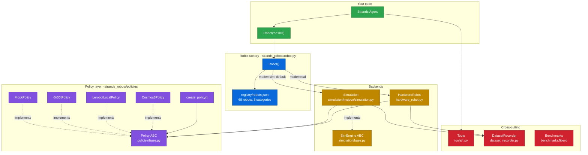

# Architecture

<figure class="brand-figure" markdown="span">
  { .brand-svg }
</figure>

## Modules

| Module | What it owns | Key types |
|--------|--------------|-----------|
| `strands_robots/robot.py` | Factory `Robot(name, mode, backend, **kwargs)`. Name resolution, sim/real dispatch, mesh attach. | `Robot()` function |
| `strands_robots/registry/` | 68 robots, 106 aliases, 8 categories. `robots.json` is source of truth. | `list_robots()`, `resolve_name()`, `get_robot()` |
| `strands_robots/simulation/` | MuJoCo `AgentTool` - 60+ actions. | `Simulation`, `SimWorld`, `SimRobot`, `SimObject`, `SimCamera` |
| `strands_robots/simulation/base.py` | Backend ABC for future Isaac/Newton backends. | `SimEngine` |
| `strands_robots/hardware_robot.py` | Real-servo path. Async task execution + status. | `Robot` (class), `TaskStatus`, `RobotTaskState` |
| `strands_robots/policies/` | ABC + 4 providers + factory + JSON registry. | `Policy`, `create_policy()` |
| `strands_robots/dataset_recorder.py` | LeRobot v3 writer. | `DatasetRecorder` |
| `strands_robots/tools/` | 8 `@tool`-decorated helpers. | `lerobot_calibrate`, `serial_tool`, etc. |
| `strands_robots/benchmarks/libero/` | LIBERO benchmark adapter. | `LiberoSuite` |

## ABCs

**`Policy`** - `get_actions(observation_dict, instruction) -> list[dict]` (async), `set_robot_state_keys(keys)`, `provider_name` property, `requires_images` property (default `True`), `reset(seed)` (default no-op). Four implementations: `MockPolicy`, `Gr00tPolicy`, `LerobotLocalPolicy`, `Cosmos3Policy`.

**`SimEngine`** - `create_world()`, `step()`, 30+ abstract actions. Today: MuJoCo CPU. Roadmap: Isaac Sim, Newton.

**Strands `AgentTool`** - `Simulation` and `HardwareRobot` are both `AgentTool` subclasses. `Agent(tools=[robot])` calls actions through the tool dispatcher.

## The one rule

**Lazy imports everywhere.** `strands_robots/__init__.py` exports `Policy`, `MockPolicy`, `create_policy` eagerly. Everything else (`Robot`, `Simulation`, `Gr00tPolicy`, the tools) is behind `__getattr__`. Enforced by `tests/test_init.py`.

## Extras

| Extra | Pulls in | When |
|-------|----------|------|
| `[sim-mujoco]` | `mujoco`, `numpy`, `imageio`, `imageio-ffmpeg` | `Robot(mode="sim")` |
| `[lerobot]` | `lerobot>=0.5.0,<0.6.0`, `torch` | Real hardware OR `LerobotLocalPolicy` |
| `[groot-service]` | `pyzmq`, `msgpack` | `Gr00tPolicy` ZMQ |
| `[cosmos3-service]` | `msgpack`, `websockets` | `Cosmos3Policy` WebSocket |
| `[mesh]` | `eclipse-zenoh`, `json5` | Multi-robot mesh |
| `[mesh-iot]` | above + `awsiotsdk`, `awscrt`, `boto3` | AWS IoT Core transport |
| `[all]` | union | CI / exploration |

## See also

- [Robot factory](getting-started/robot-factory.md) - every `Robot(...)` kwarg.
- [Custom policies](policies/custom-policies.md) - implement and register.
- [Simulation overview](simulation/overview.md) - the 60+ action vocabulary.
- [Contributing](contributing.md) - module conventions.
