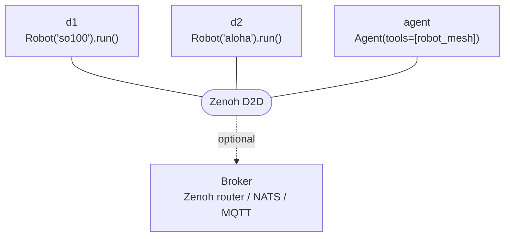

# Device Connect

[Device Connect](https://github.com/arm/device-connect) by Arm is the **recommended networking layer** for Strands Robots — a device-aware runtime that handles discovery, presence, structured RPC, event routing, and safety. `Robot("…").run()` brings a robot online as a Device Connect device, and the [`robot_mesh`](mesh.md#agent-driven-mesh) tool dispatches through it.

<video controls playsinline width="100%">
  <source src="../assets/device_connect_demo.mp4" type="video/mp4">
  Your browser does not support the video tag.
</video>

<small>A Strands agent controlling both a **simulated and a real** robot — across the country — over Device Connect.</small>

## Install

```bash
uv pip install "strands-robots[device-connect]"   # device-connect-edge + device-connect-agent-tools
```

Without the extra, `import strands_robots` still works — everything falls back to the built-in Zenoh mesh.

## Server mode — `Robot().run()`

```python
from strands_robots import Robot

r = Robot("so100")   # create the robot (optionally peer_id="so100-lab-1")
r.run()              # serve on Device Connect (blocks until Ctrl+C)
```

`.run()` stops the auto-started built-in mesh and serves the robot over Device Connect (D2D Zenoh multicast, no broker). Without `.run()` the robot is **agent-controlled** — discovered and invoked remotely via `robot_mesh` / `discover()`.

!!! warning "Secure by default"
    Device Connect does not enable unencrypted transport implicitly. To run authenticated + encrypted, point it at a bundled credentials file (`MESSAGING_CREDENTIALS_FILE` — a single `*.creds.json` with the CA, cert and key) — this works **broker-less (D2D) or brokered**, they're independent choices. For a quick trial on a **trusted, isolated LAN** you can instead skip auth (a warning is logged while active):
    ```bash
    export DEVICE_CONNECT_ALLOW_INSECURE=true
    ```
    See [Environment variables](#environment-variables) for both paths.

## Drivers

Each robot is wrapped as a Device Connect device by a `DeviceDriver` adapter:

| Driver | Wraps | Exposes |
|--------|-------|---------|
| `SimulationDeviceDriver` | a MuJoCo `Simulation` | `execute`, `getFeatures`, `getStatus`, `reset`, `step`, `stop` |
| `RobotDeviceDriver` | a hardware `Robot` | the same RPC surface, driving real servos |
| `ReachyMiniDriver` | a Pollen Reachy Mini | device-native RPCs (`look`, `nod`, …) over Zenoh / WebSocket |

`init_device_connect()` / `init_device_connect_sync()` attach the right driver and start the runtime — `Robot().run()` calls these for you.

## Driving it from an agent

The [`robot_mesh`](mesh.md#agent-driven-mesh) tool is the single entry point — the same tool for Device Connect and the mesh:

```python
from strands_robots.tools.robot_mesh import robot_mesh

robot_mesh(action="peers")                              # discover (read-only)
robot_mesh(action="tell", target="so100-lab-1",        # run a policy (HITL-approved)
           instruction="pick up the cube", policy_provider="mock")
robot_mesh(action="emergency_stop")                     # e-stop the fleet (HITL-approved)
```

### How a transport is chosen

`robot_mesh()` runs every safety gate **first**, then tries Device Connect, then falls back to the mesh:

```
rate-limit → command validation → HITL approval → Device Connect → built-in Zenoh mesh
```

Device Connect handles the action when **all** of these hold (otherwise it returns control to the mesh):

- `STRANDS_ROBOT_MESH_DC` is on (the default; the test suite sets it off),
- the action isn't mesh-only (`subscribe` / `watch` / `inbox` / `unsubscribe`),
- the agent-side connection establishes, and
- at least one Device Connect device is discovered.

Because the safety gates run *above* dispatch, Device Connect inherits the same rate limiting, validation, audit, and approval as the mesh.

## Safety

!!! danger "Human-in-the-loop on actuation"
    The actuation actions — `tell`, `send`, `stop`, `broadcast`, `emergency_stop`, `rpc` — are gated behind an out-of-band operator approval (`tool_context.interrupt`), so they run only inside a Strands agent loop where a human approves. Called from a bare script they **fail closed**. Read-only `peers` works anywhere. Approval is delivered outside the LLM's tool arguments, so prompt injection can't smuggle it. The gated set is configurable via `STRANDS_MESH_HITL_ACTIONS`.

## Architecture



## Environment variables

Most settings have safe defaults — Device Connect runs on a LAN out of the box. The one real choice is **transport security**: it's secure by default and expects mTLS certificates unless you explicitly opt into insecure transport. This is **independent of topology** — a broker-less (D2D) run can be authenticated too; the brokered setup just adds registry-based *authorization* on top.

=== "mTLS (authenticated)"

    ```bash
    # authenticated + encrypted — works broker-less (D2D) or through a router.
    # one bundled credentials file carries the CA, cert and key:
    export MESSAGING_CREDENTIALS_FILE=device.creds.json
    ```

=== "Insecure (trusted-LAN trial)"

    ```bash
    # no auth — broker-less trial on a trusted, isolated LAN; a warning is logged
    export DEVICE_CONNECT_ALLOW_INSECURE=true
    ```

### Reference

You rarely touch more than one or two of these. Grouped by what they control:

#### Transport security — how it's authenticated

| Variable | Default | What it does |
|----------|---------|--------------|
| `MESSAGING_CREDENTIALS_FILE` | unset | **The one var to enable mTLS.** A single `*.creds.json` bundling CA + cert + key. Works D2D or brokered. |
| `DEVICE_CONNECT_ALLOW_INSECURE` | unset (secure) | `true` = skip auth/encryption. **Trusted, isolated LAN only**; logs a warning. |

#### Authorization & safety — who may do what

| Variable | Default | What it does |
|----------|---------|--------------|
| `STRANDS_MESH_HITL_ACTIONS` | built-in set | Which actions need operator (human-in-the-loop) approval. |
| `DEVICE_CONNECT_RPC_ALLOW` | allow all | Caller allowlist for state-mutating RPCs (`execute`/`stop`/`step`/`reset`); `*` globs. |
| `DEVICE_CONNECT_ESTOP_ALLOW` | allow all | Caller allowlist for `emergencyStop`. |
| `STRANDS_ROBOT_MESH_AGENT_ID` | anonymous | Caller id the agent presents — **required** when a device sets an allowlist (else it's denied). |

#### Other

| Variable | Default | What it does |
|----------|---------|--------------|
| `STRANDS_ROBOT_MESH_DC` | `on` | `off` makes `robot_mesh()` skip Device Connect and use the built-in mesh only. |
| `REACHY_DAEMON_TOKEN` | unset | Auth token for the Reachy Mini daemon, if it requires one. |

!!! warning "Allowlists are a hard boundary only under mTLS"
    Over insecure D2D the caller id is self-asserted, so `DEVICE_CONNECT_RPC_ALLOW` / `DEVICE_CONNECT_ESTOP_ALLOW` are *advisory* (a one-time warning is logged). For a real authorization boundary, run the brokered setup with mTLS, which binds the caller id to the sender's certificate.

## Full infrastructure (optional)

D2D is enough for a single LAN. For production — many devices, multiple sites, real authorization — add the Device Connect **server stack**: a **Zenoh router** (or NATS / MQTT broker) + **etcd** + the **device registry**.

**What it adds over D2D**

- **Persistent registry** — devices register with TTL leases; discover them by type, location, or capability.
- **Authorization** — per-device ACLs, a central CA, and certificate revocation (the allowlists above become a *hard* boundary).
- **Distributed state & locks** — etcd-backed coordination, e.g. one agent per arm.
- **Cross-network routing** — across subnets and sites, not just the local LAN.

**Switching to it** — every example on this page works unchanged:

1. **Start the stack** — Docker Compose brings up the Zenoh router, etcd, and registry.
2. **Point peers at it** — set `MESSAGING_BACKEND`, `ZENOH_CONNECT=<router>`, and your mTLS `MESSAGING_CREDENTIALS_FILE`.
3. **Run as usual** — devices auto-register, and discovery flows through the registry instead of multicast scouting.

The broker-specific variables (everything else is shared with D2D):

| Variable | Set to | Why |
|----------|--------|-----|
| `MESSAGING_BACKEND` | `zenoh` / `nats` / `mqtt` | Which broker protocol the stack runs |
| `ZENOH_CONNECT` | `tcp/<router-host>:7447` | The router / broker endpoint (replaces LAN multicast) |

See the [GUIDE](https://github.com/strands-labs/robots/blob/main/strands_robots/device_connect/GUIDE.md) for the Docker Compose file.

## See also

- [Device Connect GUIDE](https://github.com/strands-labs/robots/blob/main/strands_robots/device_connect/GUIDE.md) — full end-to-end demo (D2D + full infra), Reachy Mini, and smoke tests.
- [Multi-robot mesh](mesh.md) — the built-in Zenoh fallback layer.
- [AI agents](agents.md) — drive it with natural language.
- [Device Connect source](https://github.com/strands-labs/robots/tree/main/strands_robots/device_connect) — drivers and runtime wiring.
