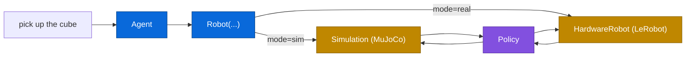

# Strands Robots

<figure class="brand-figure" markdown="span">
  { .brand-svg }
</figure>

A robot library for [Strands agents](https://strandsagents.com). You name a robot, you get something you can drive - in simulation by default, or on real hardware when you ask for it.

```python
from strands import Agent
from strands_robots import Robot

robot = Robot("so100")
agent = Agent(tools=[robot])
agent("Pick up the red cube")
```

`Robot("so100")` gives you a MuJoCo simulation - no GPU, runs on a laptop. Add `mode="real"` and the same code drives a physical arm. The agent sees one tool with 60+ actions; it figures out which to call.



The agent decides *what* to do. The policy (Mock, GR00T, LeRobot, or Cosmos 3) decides *how*. The backend - physics or servos - does it.

## Start here

- **New?** [Quickstart](getting-started/quickstart.md) gets a robot moving in five minutes.
- **Building something?** [Quickstart](getting-started/quickstart.md) gets a robot picking up a cube; the [simulation](simulation/overview.md) and [policy](policies/overview.md) pages take it from there.
- **Looking for a robot?** [68 of them](robots/index.md), every one addressable by name.
- **Want the shape of it?** [Architecture](architecture.md) is one diagram and a table.

## Install

```bash
uv pip install "strands-robots[sim-mujoco]"   # simulation
uv pip install "strands-robots[all]"          # sim + hardware + every policy
```
