# Multi-robot mesh

<figure class="brand-figure" markdown="span">
  { .brand-svg }
</figure>

Every `Robot()` auto-joins a Zenoh mesh. Peers discover each other on the LAN and can query, command, and e-stop one another.

!!! info "Device Connect is the recommended networking layer"
    What's described here is the built-in **Zenoh mesh** — the automatic fallback. When the [`device-connect`](device-connect.md) extra is installed, `Robot().run()` and `robot_mesh()` use [**Device Connect**](device-connect.md) (structured RPC, presence, registry, safety) and fall back to this mesh only when it's unavailable. Both ride on Zenoh.

```python
# process A
from strands_robots import Robot
sim_a = Robot("so100")
print(sim_a.mesh.peers)          # discovers sim_b within ~1 s

# process B
sim_b = Robot("aloha")
sim_a.mesh.tell(sim_b.mesh.peer_id, "pick up the cube",
                policy_provider="mock", duration=10.0)
```

```bash
uv pip install "strands-robots[mesh]"   # eclipse-zenoh; already in the default install
```

## Key mesh calls

```python
# Point-to-point status query
result = sim_a.mesh.send(target_peer_id, {"action": "status"}, timeout=5.0)

# Fan-out → list of responses collected within timeout
results = sim_a.mesh.broadcast({"action": "status"}, timeout=2.0)

# Safety primitive - writes a tamper-evident audit log
sim_a.mesh.emergency_stop()   # STRANDS_MESH_AUDIT_DIR overrides log location
```

## Published topics

| Topic | Rate | Content |
|-------|------|---------|
| `strands/{peer_id}/presence` | 2 Hz | heartbeat / peer discovery |
| `strands/{peer_id}/state` | 10 Hz | joints, sim time, task status |
| `strands/{peer_id}/cmd` | on demand | incoming RPC commands |
| `strands/{peer_id}/response/{id}` | on demand | RPC replies (turn_id correlated) |
| `strands/{peer_id}/stream` | on demand | VLA execution steps |
| `strands/{peer_id}/pose` | on demand | SE(3) from SLAM/odom/VIO |
| `strands/{peer_id}/imu` | on demand | orientation, gyro, accel |
| `strands/{peer_id}/health` | on demand | battery, CPU, memory |
| `strands/broadcast` | on demand | fan-out RPC |

Sensor topics only publish when the robot exposes the attribute. Zero cost when unused.

## Agent-driven mesh

```python
from strands import Agent
from strands_robots.tools import robot_mesh

agent = Agent(tools=[sim_a, robot_mesh])
agent("Find every robot on the mesh and ask each one to report its status")
agent("E-STOP all peers")
```

## Mesh teleop

```python
# Machine A - leader publishes at 50 Hz  # requires hardware
leader = Robot("so100", mode="real")
leader.start_teleop_publish(teleoperator=leader.teleoperator,
                            device_name="leader", method="arm", hz=50)

# Machine B - follower applies incoming actions  # requires hardware
follower = Robot("so100", mode="real")
follower.start_teleop_receive(source_peer_id=leader.mesh.peer_id,
                              device_name="leader", apply_fn=None)

leader.stop_teleop("leader")
follower.stop_teleop("leader")
```

`get_teleop_status()` on either side inspects current teleop state.

## Disable

| Method | Scope |
|--------|-------|
| `STRANDS_MESH=false` | process-wide kill switch |
| `Robot("so100", mesh=False)` | per-robot opt-out |

Mesh failures are non-fatal - `robot.mesh` becomes `None`; the sim/hardware instance still works.

## See also

- [Device Connect](device-connect.md) - the recommended networking layer this mesh backs.
- [AI agents](agents.md) - drive the mesh with natural language.
- [Architecture](architecture.md) - where the mesh sits in the module map.
- [Mesh source](https://github.com/strands-labs/robots/tree/main/strands_robots/mesh) - `core.py`, `session.py`, `audit.py`, `sensors.py`, `input.py`.
