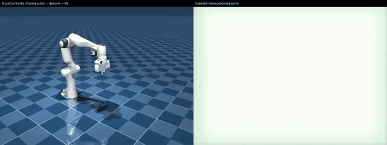

# Cosmos 3

```bash
uv pip install "strands-robots[cosmos3-service]"   # adds msgpack + websockets; no openpi-client needed
```

```python
from strands_robots.policies import create_policy

policy = create_policy("cosmos3", embodiment="droid", port=8000)
# or: create_policy("cosmos3://localhost:8000")
```

## Start the server

```bash
python -m cosmos_framework.scripts.action_policy_server_robolab \
    --checkpoint-path nvidia/Cosmos3-Nano-Policy-DROID --port 8000
# embodiment is selected client-side via create_policy(..., embodiment="droid")
```

## Parameters

```python
Cosmos3Policy(
    embodiment="droid",          # droid | umi | av | bridge
    host="localhost",
    port=8000,
    action_space=None,
    observation_mapping=None,
    action_mapping=None,
    robot=None,                  # "franka" or "panda" for built-in DROID→sim mapping
    prompt="",
    api_key=None,
    client=None,
    transport="raw",
    backend="service",          # "service" (default) | "diffusers" (in-process)
    mode="policy",              # "policy" | "forward_dynamics" | "inverse_dynamics" (diffusers only)
    model=None,                 # HF repo id / path for the diffusers backend
)
```

## Embodiments

| Embodiment | Robot hardware | Strands sim asset |
|------------|----------------|-------------------|
| `droid` | Franka / DROID dataset | `"panda"` or `"franka"` |
| `umi` | UMI gripper | - |
| `av` | Autonomous vehicle cameras | - |
| `bridge` | Bridge dataset robots | - |

## Backends

Cosmos3Policy can run Cosmos 3 two ways. The default is unchanged.

| backend | how it runs | install | extra outputs |
|---------|-------------|---------|---------------|
| `service` (default) | WebSocket to the Cosmos Framework RoboLab policy server (holds the GPU out-of-process) | `strands-robots[cosmos3-service]` (msgpack + websockets, numpy-agnostic) | none (server video discarded) |
| `diffusers` | in-process via native `diffusers` (`Cosmos3OmniPipeline`) | `strands-robots[cosmos3-diffusers]` + diffusers-from-source | world video + sound on `last_rollout` |

```bash
# in-process backend (heavy GPU stack: diffusers + torch)
uv pip install "strands-robots[cosmos3-diffusers]" \
    'diffusers @ git+https://github.com/huggingface/diffusers'
```

The `cosmos3-diffusers` extra is native `diffusers` + `torch` + `transformers`
(no extra wrapper package). It composes with `numpy>=2` (and therefore with
`lerobot` dataset recording in the same env), so it is co-installable with
`cosmos3-service`.

> **Action layout note.** The `diffusers` backend returns the model's **raw
> unified action** (DROID = 9D end-effector pose `tx,ty,tz,r0..r5` + 1D `grasp`
> = 10D), named by the embodiment `raw_action_layout`. This is the pipeline's
> native output, *before* the RoboLab server's `joint_pos` (8D) conversion. Use
> `backend="service"` when you need joint-position commands.

> **Safety checker / `cosmos_guardrail`.** `Cosmos3OmniPipeline` builds a
> `CosmosSafetyChecker` at load time, which requires the heavy optional
> `cosmos_guardrail` package and otherwise raises `ImportError: cosmos_guardrail
> is not installed`. The diffusers backend disables it by default
> (`enable_safety_checker=False`, passed through to `from_pretrained`) so the
> pipeline loads without that extra. Install `cosmos_guardrail` and pass
> `enable_safety_checker=True` to re-enable it. Note Cosmos runs in `bfloat16`,
> so the backend up-casts the half-precision action tensor to `float32` before
> returning the chunk.

### `backend="diffusers"` — world video alongside the action chunk

One in-process forward pass returns the predicted world video, optional sound,
**and** the robot action chunk. The action chunk is returned through the normal
`get_actions` -> `list[dict]` contract; the world video/sound are surfaced on
`policy.last_rollout` (the Policy ABC return type is unchanged).

```python
from strands_robots.policies import create_policy

policy = create_policy(
    "cosmos3",
    embodiment="droid",
    backend="diffusers",
    model="nvidia/Cosmos3-Nano",  # HF repo id or local path
)
policy.set_robot_state_keys([f"joint_{i}" for i in range(7)] + ["gripper"])

steps = policy.get_actions_sync(observation, "pick up the red cube")
# steps == [{"tx": .., "ty": .., ..., "r5": .., "grasp": ..}, ...]  (raw unified
# action, one dict per timestep)

# the predicted world video Cosmos rolled out for that action chunk:
print(policy.last_rollout["video"])   # path to an .mp4 / .gif
print(policy.last_rollout["sound"])   # path to a .wav, or None
```

### Action modes (diffusers only)

The diffusers backend exposes Cosmos 3's full physics loop via the `mode` kwarg
(`CosmosActionCondition.mode`). These do **not** exist in service mode — passing
a non-`policy` mode under `backend="service"` raises a clear error.

| `mode` | conditioning | predicts | `get_actions` returns |
|--------|--------------|----------|------------------------|
| `policy` (default) | first frame + task prompt | future video **+ actions** | action chunk (`list[dict]`) |
| `forward_dynamics` | first frame + given `raw_actions` | future video | `[]` (world video on `last_rollout`) |
| `inverse_dynamics` | an observed video | the actions between frames | action chunk (`list[dict]`) |

All three modes are verified live on real `nvidia/Cosmos3-Nano` weights (Thor, bf16/CUDA): `policy` → 32-step action chunk + world video; `forward_dynamics` → world video only (`get_actions` returns `[]`); `inverse_dynamics` → 32-step action chunk recovered from an observed video. See `docs/assets/cosmos3/live_modes_metrics.json`.

```python
# forward dynamics: "what world results if I run these actions?"
fd = create_policy("cosmos3", embodiment="droid", backend="diffusers", mode="forward_dynamics")
fd.set_robot_state_keys([f"joint_{i}" for i in range(7)] + ["gripper"])
fd.get_actions_sync(observation, "", raw_actions=my_action_chunk)
print(fd.last_rollout["video"])   # predicted world rollout

# inverse dynamics: "what actions produced this observed video?"
inv = create_policy("cosmos3", embodiment="droid", backend="diffusers", mode="inverse_dynamics")
inv.set_robot_state_keys([f"joint_{i}" for i in range(7)] + ["gripper"])
steps = inv.get_actions_sync(observation, "", video="observed.mp4")
```

### Closing the sim loop: de-normalize → IK → MuJoCo

The `diffusers` backend returns the model's **raw unified action** — for the
DROID/Franka domain that is `[tx, ty, tz, r0..r5, grasp]`, **quantile-normalized
to `[-1, 1]`** and encoding a *relative end-effector pose delta* per step, **not
joint radians**. Feeding it straight into MuJoCo joint actuators is physically
meaningless (the normalized columns land arbitrarily inside/outside real joint
limits; MuJoCo silently clamps and the arm doesn't track). Three honest
geometric steps (`cosmos3-sim` extra) turn it into joint targets a MuJoCo arm
actually follows:

1. **De-normalize** — invert the quantile transform with the embodiment's
   bundled `q01`/`q99` action stats:
   `denorm = 0.5 * (a + 1) * (q99 - q01) + q01`
   (`denormalize_quantile`; stats bundled under `policies/cosmos3/stats/`).
2. **Decode poses** — integrate the per-step `[translation(3), rot6d(6)]` deltas
   into an absolute `(T+1, 4, 4)` SE3 trajectory anchored at the robot's current
   EE pose (`decode_pose_trajectory`).
3. **Inverse kinematics** — solve each Cartesian target to joint angles with
   [`mink`](https://github.com/kevinzakka/mink) differential IK on the *same*
   `mujoco.MjModel` (a `FrameTask` on the EE body + a `PostureTask` regularizer),
   warm-starting each step (`MinkIKBridge`).

```python
import mujoco, numpy as np
from robot_descriptions import panda_mj_description
from strands_robots.policies.cosmos3 import (
    Cosmos3Policy, MinkIKBridge, decode_cosmos_chunk_to_targets,
)
from strands_robots.policies.cosmos3.embodiments import get_embodiment

policy = Cosmos3Policy(embodiment="droid", backend="diffusers", model="nvidia/Cosmos3-Nano")
policy.set_robot_state_keys([f"joint_{i}" for i in range(7)] + ["gripper"])
chunk_dicts = policy.get_actions_sync(observation, "pick up the red cube")
raw_chunk = policy.last_rollout["action"]          # [T, 10] raw [-1,1] action

model = mujoco.MjModel.from_xml_path(panda_mj_description.MJCF_PATH)
bridge = MinkIKBridge(model, ee_frame_name="hand", ee_frame_type="body")
q_init = np.zeros(model.nq); q_init[:7] = [0, -0.3, 0, -2.2, 0, 2.0, 0.79]

out = decode_cosmos_chunk_to_targets(raw_chunk, get_embodiment("droid"), bridge, q_init)
out["qpos"]            # [T, nq] joint targets to send to MuJoCo
out["gripper"]         # [T] grasp column (None for grasp-less embodiments)
out["tracking_error"]  # {"mean_mm", "max_mm"} Cartesian tracking error
```

Verified on Thor against real `nvidia/Cosmos3-Nano` weights, a reachable EE
trajectory tracks to **mean ≈ 11.5 mm / max ≈ 42.8 mm** — the bar pinned by the
`tests/policies/cosmos3/test_sim_ik.py` regression. (Errors grow only when the
de-normalized deltas are scaled past the ~0.85 m Franka reach — a workspace
concern, not an IK one.)

> **The Cosmos "modes" are not FK/IK.** `policy` / `forward_dynamics` /
> `inverse_dynamics` are world-model *conditioning* modes (video↔action), not a
> kinematics solve. Joint-space IK is this separate geometric layer applied
> *after* Cosmos.
>
> The reverse map — joints → Cartesian pose — is **forward kinematics**, exposed
> as `MinkIKBridge.ee_pose(qpos) -> (4, 4)`. Step 2 above anchors the decoded SE3
> trajectory at the robot's current EE pose via exactly this FK call, and the IK
> solver uses it internally to score each Cartesian target.



*Left: MuJoCo Franka driven by a **real** `nvidia/Cosmos3-Nano` action chunk through de-normalize → decode → IK. Right: the Cosmos predicted world video from the same forward pass. Runnable: `examples/cosmos3_diffusers_mujoco_rollout.py --render out.mp4`.*

> Install the sim bridge: `uv pip install "strands-robots[cosmos3-sim]"`
> (pulls `mink` + `mujoco`; numpy>=2 compatible, co-installable with
> `cosmos3-diffusers` / `cosmos3-service` / `sim-mujoco` / `lerobot`).

## Rollout

```python
from strands_robots import Robot

sim = Robot("panda")
sim.run_policy(
    robot_name="panda",
    instruction="pick up the red block",
    policy_provider="cosmos3",
    policy_config={"embodiment": "droid", "robot": "panda", "port": 8000},
    duration=15.0,
    control_frequency=50.0,
)
# see examples/cosmos3_sim_rollout.py
```

`robot="panda"` activates the built-in DROID-layout mapping (`joint_0..6/gripper` → `joint1..7/finger_joint1`). `requires_images=True`.

## See also

- [Policy overview](overview.md)
- [GR00T](groot.md)
- [LeRobot Local](lerobot-local.md)
- [Custom policies](custom-policies.md)
- [cuRobo](curobo.md)
- [Policy providers](../policies/overview.md)
